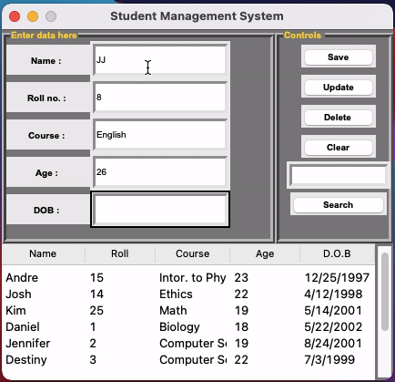

# Project - Student Management System 

Student Management System is a project which basically saves the user data using sqlite3 database and allows perform certain operations on that data,
      such as delete, update, and search it.
      

Time spent: 5 hours spent in total

## User Stories

The following **required** functionality is completed:

- [x] User can create a new user using the save button.
- [x] User can update attribute of a created user using the update button.
- [x] User can search a specific user using the Roll No.
- [x] User can clear the entire set of data entered using the clear button.

- [X] User can delete a specific user

## Video Walkthrough

Here's a walkthrough of implemented user stories:

## Open-source libraries used

- [Python Programming with Tkinter](https://realpython.com/python-gui-tkinter/)
- [Tkinter Documentation](https://www.tutorialspoint.com/python/tk_button.htm) 

## License

    Copyright [2021] [Getaante Yilma]

    Licensed under the Apache License, Version 2.0 (the "License");
    you may not use this file except in compliance with the License.
    You may obtain a copy of the License at

        http://www.apache.org/licenses/LICENSE-2.0

    Unless required by applicable law or agreed to in writing, software
    distributed under the License is distributed on an "AS IS" BASIS,
    WITHOUT WARRANTIES OR CONDITIONS OF ANY KIND, either express or implied.
    See the License for the specific language governing permissions and
    limitations under the License.
